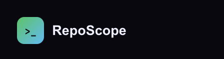
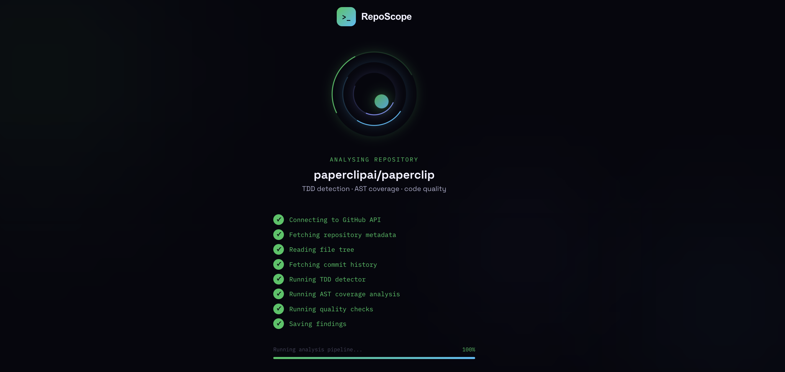
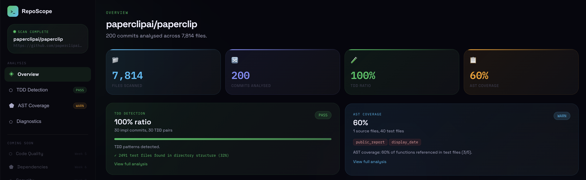

<div align="center">



# RepoScope

Discover multiple ways to improve your repository.

[Quickstart](#quickstart) · [How It Works](#how-it-works) · [Features](#features) · [API](#api-reference)

[](LICENSE)
[](https://nodejs.org)
[](https://react.dev)
[](https://supabase.com)
[](https://github.com/SALMANUDDIN-TALHA-MOHD/RepoScope/stargazers)

</div>

<br/>

<div align="center">

</div>

<br/>

RepoScope is the tool developers use to understand what is actually happening inside a repository — before a release, before a code review, or before joining a new codebase.

Paste a public GitHub URL. RepoScope fetches up to 200 commits and every source file, runs six analysis checks in sequence, and returns a structured report in plain English with specific advice for each finding.

**If your repository is the codebase, RepoScope is the health report.**

---

## Dashboard

<div align="center">

</div>

*`paperclipai/paperclip` — 200 commits analysed across 7,807 files. TDD: 100% PASS. AST coverage: 60% WARN.*


---

## RepoScope is right for you if

✅ You want to know whether your team actually practices TDD, not just claims to  
✅ You want to see exactly which functions have no test coverage  
✅ You are joining a new codebase and want a full picture before writing a line  
✅ You want to find CVEs in your dependencies without running a separate audit tool  
✅ You want to catch hardcoded secrets and OWASP vulnerabilities before they ship  
✅ You want one dashboard that covers commits, source code, dependencies, and security  
✅ You want actionable output in plain English, not raw numbers  

---

## The Six Checks

| Check | What it analyses |
|---|---|
| **TDD Detection** | Commit history keywords, 5-commit lookback window, directory structure signal |
| **AST Coverage** | Function names extracted from the syntax tree, cross-referenced against test files |
| **Code Quality** | Cyclomatic complexity per function, code smell detection, duplicate block identification |
| **Dependency Audit** | CVE scanning via the NVD database for every declared package |
| **Security Scan** | OWASP Top 10 patterns, secret detection, hardcoded credential scanning across all committed files |
| **AI Summary** | Google Gemini generates prioritised plain-English recommendations from all findings |

---

## How It Works

```
01   Paste a public GitHub URL

02   POST /api/scan fetches the full file tree
     and up to 200 commits across two API pages

03   TDD Detector
     reverses commits to chronological order
     classifies each as implementation or test by keyword
     runs a 5-commit lookback window for each impl commit
     checks the directory tree for structural test signals

04   AST Analyser
     parses JS/TS with @babel/parser into a full syntax tree
     extracts every function declaration, arrow function, class method
     uses regex for Python — def and class patterns
     cross-references each name against all test file content

05   Code Quality Checker
     calculates cyclomatic complexity for every function
     flags functions over 50 lines or with more than 4 parameters
     hashes 8-line blocks to find duplicates across files

06   Dependency Auditor
     reads package.json for every declared package
     queries the NVD database for CVEs by package and version
     returns severity score, affected range, and patched version

07   Security Scanner
     applies regex patterns for AWS keys, tokens, private keys,
     database strings, and hardcoded passwords across all files
     matches OWASP Top 10 patterns against endpoint code

08   AI Summary
     passes all findings to Google Gemini
     returns a prose paragraph naming the top issues
     and the expected impact of fixing each one

09   Results save to Supabase
     stored in memory immediately, Supabase asynchronously
     frontend polls every 1.5 seconds
     dashboard renders the moment status is complete
```

---

## Features

**200-commit analysis**
Two full pages of GitHub commit history — up to 200 commits — for a more accurate TDD ratio than the standard 30-commit window.

**TDD commit detection**
Every commit classified by keyword. Implementation: feat, fix, build, create, implement, add, update, chore. Test: test, spec, tdd, failing test, write test, add test. For each implementation commit, the engine looks back five commits for a prior test. Confirmed pairs divided by total implementation commits gives the ratio.

**Structural TDD signal**
The full file tree is examined for `tests/`, `__tests__/`, and `specs/` directories and for files matching `*.test.js`, `test_*.py`, and `*_test.go`. Count and ratio reported alongside the commit-based score.

**AST function coverage**
`@babel/parser` builds a full Abstract Syntax Tree from every JS/TS file. The walker collects `FunctionDeclaration`, `ArrowFunctionExpression`, and `ClassMethod` nodes. Python files use regex. Each name is searched across all test files. Two lists returned: tested functions and untested functions.

**Cyclomatic complexity**
Every function scored by decision-point count — `if`, `else`, `for`, `while`, `switch case`, ternary, logical operators. Score 1 to 5 is simple. Score 6 to 10 is moderate. Score 11 and above is flagged for refactoring.

**CVE audit**
`package.json` parsed, every dependency looked up in the NVD database, any CVE returned with ID, CVSS score, affected version range, and the patch version.

**Secret and OWASP scanning**
Regex patterns across every committed file. AWS access keys, GitHub tokens, private keys, database connection strings, hardcoded passwords. OWASP Top 10 matched against endpoint code.

**AI summary**
All findings passed to Google Gemini with a structured prompt. Response is a prose paragraph naming the top three things to fix and the expected impact of each.

**Memory-first reliability**
Results stored in memory immediately, Supabase asynchronously. If Supabase is unreachable the frontend still receives correct results.

---

## Quickstart

Open source. Self-hosted. No RepoScope account required.

**Requirements:** Node.js 18+, npm

```bash
git clone https://github.com/SALMANUDDIN-TALHA-MOHD/RepoScope.git
cd RepoScope
npm install
cd backend && npm install @babel/parser && cd ..
```

Create `backend/.env`:

```env
GITHUB_TOKEN=your_github_personal_access_token
SUPABASE_URL=https://your-project.supabase.co
SUPABASE_SERVICE_KEY=your_supabase_service_role_key
GEMINI_API_KEY=your_gemini_api_key
PORT=5000
```

> Supabase is optional. If credentials are missing, results are stored in memory and the frontend still receives correct findings in the same session.

```bash
lsof -ti:5000 | xargs kill -9 && npm run dev
```

Open `http://localhost:5173`, paste any public GitHub URL, and click Analyse.

---

## Severity Thresholds

**TDD Detection**

| Ratio | Badge | Meaning |
|---|---|---|
| 60% and above | PASS | Strong TDD discipline |
| 30% to 59% | WARN | Partial TDD usage |
| Below 30% | INFO | TDD not detected |

**AST Coverage**

| Coverage | Badge | Meaning |
|---|---|---|
| 70% and above | PASS | Good coverage |
| 40% to 69% | WARN | Partial coverage |
| Below 40% | INFO | Low coverage |

**Cyclomatic Complexity**

| Score | Badge | Meaning |
|---|---|---|
| 1 to 5 | PASS | Simple — easy to test |
| 6 to 10 | WARN | Moderate — consider splitting |
| 11 and above | FAIL | High — refactor before release |

**CVE Severity**

| CVSS Score | Badge | Action |
|---|---|---|
| 9.0 and above | CRITICAL | Patch immediately |
| 7.0 to 8.9 | HIGH | Patch before next release |
| 4.0 to 6.9 | MODERATE | Schedule a patch |
| Below 4.0 | LOW | Patch at next convenience |

---

## Supported Languages

| Language | Method | Test patterns |
|---|---|---|
| JavaScript | @babel/parser AST | `*.test.js`, `*.spec.js`, `tests/` |
| TypeScript | @babel/parser AST | `*.test.ts`, `*.spec.ts` |
| JSX / TSX | @babel/parser AST | `*.test.jsx`, `*.test.tsx` |
| Python | Regex | `test_*.py`, `*_test.py`, `conftest.py` |
| Go | Structural signal only | `*_test.go` detected |
| Java, Rust, Ruby | Planned | Future releases |

---

## API Reference

**Start a scan**

```http
POST /api/scan
Content-Type: application/json

{ "repoUrl": "https://github.com/owner/repo" }
```

```json
{ "scanId": "9f14...", "status": "running" }
```

**Poll for results** — every 1.5 seconds until `status` is `"complete"` or `"error"`

```http
GET /api/scan/:id
```

```json
{
  "status": "complete",
  "findings": [
    {
      "category": "tdd",
      "severity": "pass",
      "tddRatio": 100,
      "codeCount": 29,
      "tddCount": 29,
      "structuralSignal": { "hasTestDirectory": true, "testFileCount": 2488, "testFileRatio": 32 }
    },
    {
      "category": "unit_test",
      "severity": "warn",
      "coverage": 60,
      "untestedFunctions": ["public_report", "display_date"],
      "testedFunctions": ["parseArgs", "normalizeApiBase", "apiRequest"],
      "sourceFilesAnalysed": 1,
      "testFilesAnalysed": 40
    },
    { "category": "code_quality", "severity": "warn", "message": "2 functions exceed complexity 10." },
    { "category": "dependency",   "severity": "high",  "message": "lodash@4.17.15 — CVE-2020-8203 (HIGH). Fix: 4.17.21" },
    { "category": "security",     "severity": "pass",  "message": "No secrets detected." },
    { "category": "ai_summary",   "severity": "info",  "message": "Patch lodash. Add tests for public_report and display_date. Refactor heartbeatExecutor." }
  ],
  "summary": { "totalFiles": 7807, "totalCommits": 200, "findingsCount": 6 }
}
```

**Health check**

```http
GET /api/health
```

---

## Development

```bash
npm run dev           # Start frontend and backend together
npm run dev:frontend  # Frontend only — Vite on :5173
npm run dev:backend   # Backend only — Express on :5000
npm run build         # Production build
```

---

## Database Schema

```sql
CREATE TABLE scans (
  id          UUID PRIMARY KEY,
  repo_url    TEXT NOT NULL,
  owner       TEXT NOT NULL,
  repo        TEXT NOT NULL,
  status      TEXT NOT NULL DEFAULT 'running',
  summary     JSONB,
  tdd_ratio   INTEGER,
  created_at  TIMESTAMPTZ DEFAULT NOW(),
  completed_at TIMESTAMPTZ
);

CREATE TABLE findings (
  id           UUID PRIMARY KEY DEFAULT gen_random_uuid(),
  scan_id      UUID REFERENCES scans(id),
  category     TEXT NOT NULL,
  severity     TEXT NOT NULL,
  message      TEXT,
  detail       TEXT,
  file_path    TEXT,
  line_number  INTEGER,
  created_at   TIMESTAMPTZ DEFAULT NOW()
);

CREATE TABLE reviews (
  id          UUID PRIMARY KEY DEFAULT gen_random_uuid(),
  name        TEXT,
  role        TEXT,
  rating      INTEGER CHECK (rating BETWEEN 1 AND 5),
  text        TEXT,
  created_at  TIMESTAMPTZ DEFAULT NOW()
);
```

**Contact form** uses [Formspree](https://formspree.io) — create a free account, copy your form ID, and set `FORMSPREE_ID` in `src/components/Community.jsx`. No backend required for contact messages.

**Reviews** are submitted via `POST /api/reviews` and stored in the Supabase `reviews` table. The community section loads them live on page render via `GET /api/reviews`.

---

## Academic Context

Built at **Loyola University Chicago** as part of **COMP 490 Independent Study**
under **Professor Yacobellis** · Fall 2026

---

## License

MIT © 2026 Mohd Salmanuddin Talha

<div align="center">

Open source · Loyola University Chicago · COMP 490 · Fall 2026

</div>